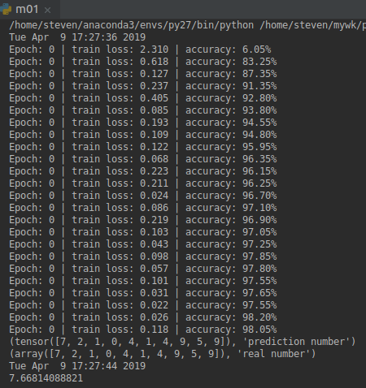
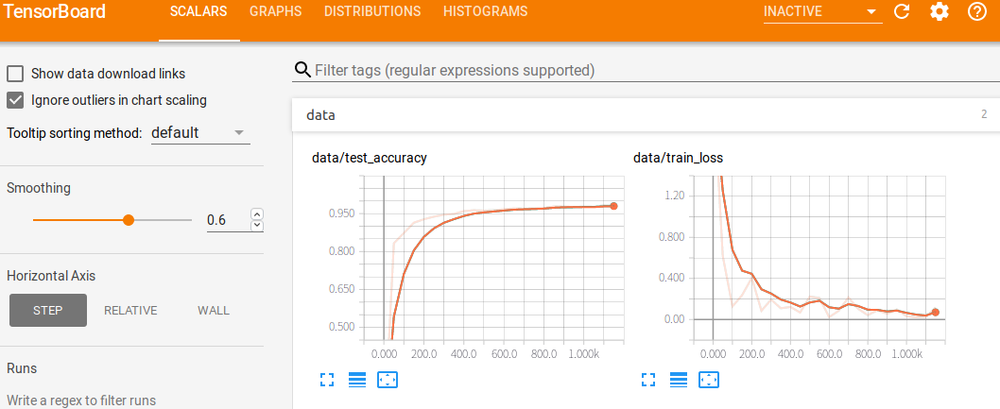
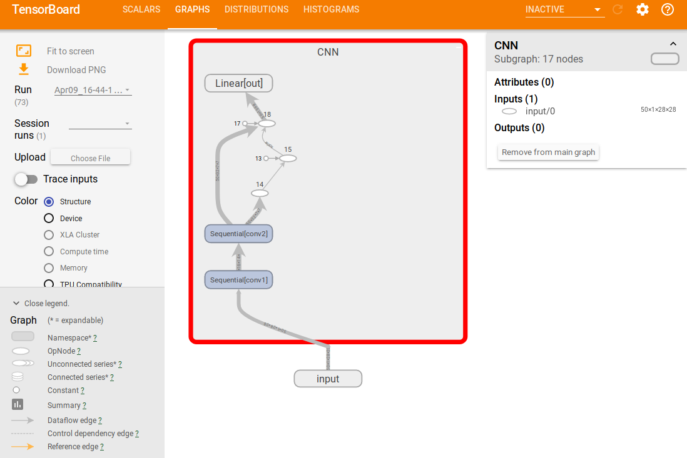
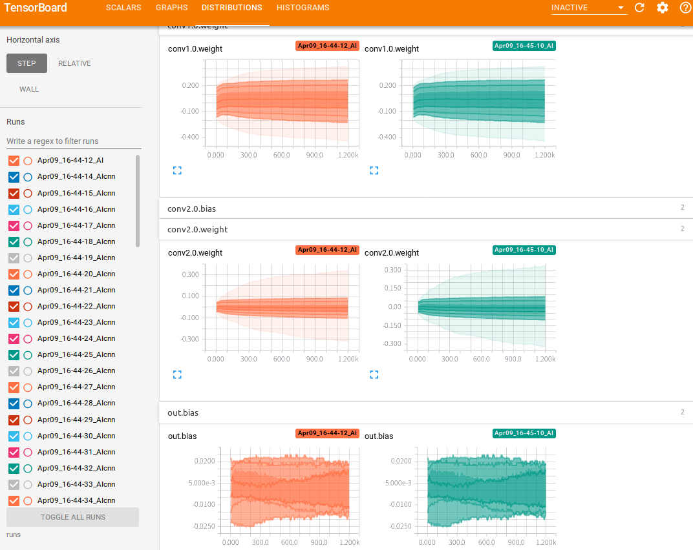
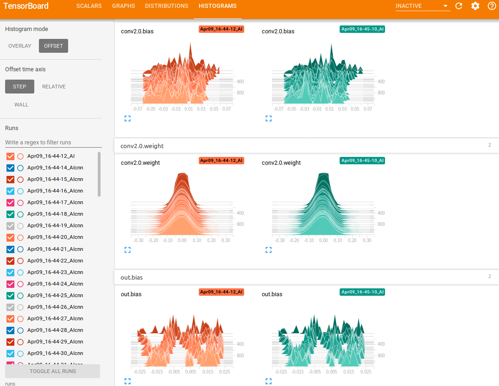

# 文件说明
m01.py是不加可视化的数字识别在pytorch的实现
m02.py是加可视化的数字识别在pytorch的实现
这两个文件都支持cuda的自动识别，速度相差一倍以上

# tensorboardX 运行：
在主目录下，runs目录外运行：tensorboard --logdir runs

# python3 vs python2
python2/3都可以run tensorboardX
python2/3都可以run m01.py和m02.py
python2 速度快于 python3

# 使能调试开关
USE_CUDA    :CUDA开关 
USE_boardX  :可是化开关

# CUDA
CUDA开启后，可视化boardX相关参数也要用.cuda， 如x.cuda()
CUDA下的，需要变：
    小批量数据格式,如：b_x.cuda()
    test数据格式,如：test_y.cuda()
    网络：cnn().cuda()
    以及 可视化 add 的 全部x数据: x.cuda()
    
# Result

# tensorboardX
##Scalars

